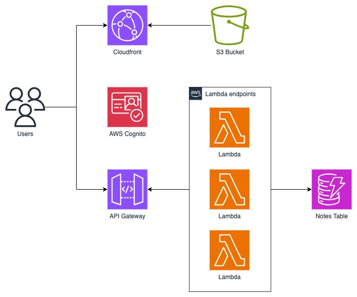

# AWS Cloud Native SST Stack

A fullstack SST template complete with Cognito authentication, DynamoDB, and a React frontend.

# Contents

 

This projects contains the following:

- a full CRUD API of data called notes
- an authentication system connected to AWS Cognito
- a React frontend with TailwindCSS that serves as the GUI

# Setup

1. Ensure that the AWS CLI is installed.
2. Clone the project.
3. `cd` into the project directory.
4. Install dependencies with `pnpm` through `pnpm install`.
5. Deploy with `pnpm sst deploy`.
